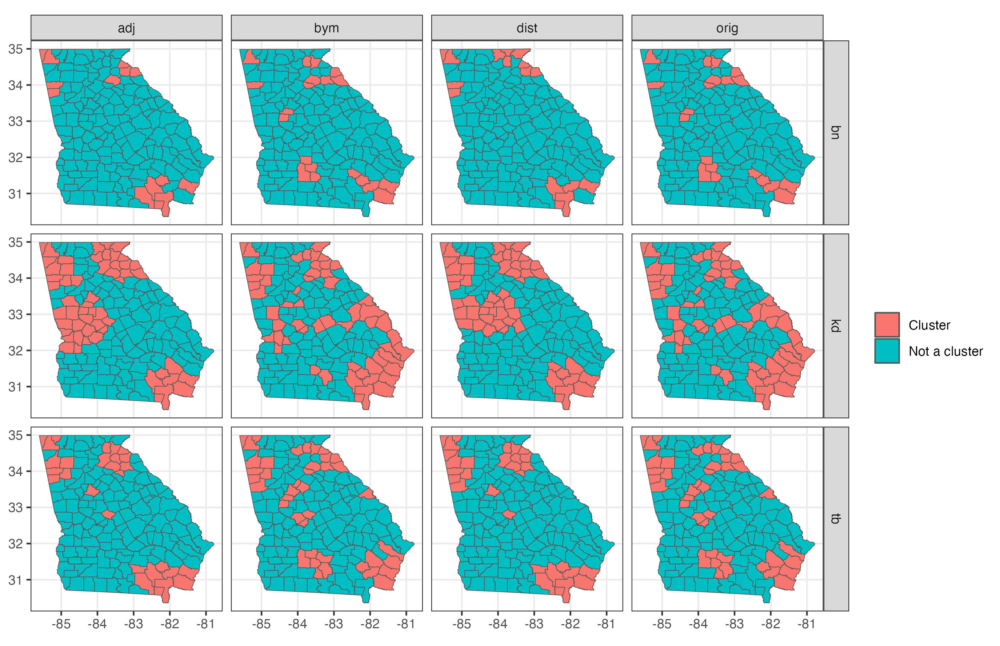

# Opioid Overdose Mortality in Georgia

This repository is home to my own personal analysis of opioid overdose
data in Georgia. In particular, I apply three difference spatial
clustering tests to opioid overdose mortality data in Georgia, obtained
from the Online Analytical Statistical Information System
([OASIS](https://oasis.state.ga.us)). These tests include the Cluster
Evaluation Permutation Procedure test of [Turnbull et
al. (1990)](https://doi.org/10.1093/oxfordjournals.aje.a115775), the
[Besag-Newell test (1991)](https://doi.org/10.2307/2982708), and the
original spatial scan test of [Kulldorff
(1997)](https://doi.org/10.1080/03610929708831995).

In addition to applying these tests to the raw counts reported by OASIS,
I have also applied various smoothing techniques (adjacency,
distance-based, and Bayesian via the BYM model) a priori to see how this
may affect the ability of these tests to detect clusters. The figure
below demonstrates the clusters, or “hot-spots” determined by each
combination of methods for the year 2021.

Opioid Overdoses in Georga

See below for a listing of the clusters, ordered by test. Counties are
included along with: 1) Total number of deaths, 2) expected number of
deaths, and 3) mortality rate (per 1,000).

<table>
<caption>
Listing of Identified Clusters
</caption>
<thead>
<tr>
<th style="text-align:left;">
Test
</th>
<th style="text-align:left;">
Cluster ID
</th>
<th style="text-align:left;">
Cluster Members (# Death, \# Expected, Mortality Rate)
</th>
</tr>
</thead>
<tbody>
<tr>
<td style="text-align:left;width: 10%; ">
Besag and Newell
</td>
<td style="text-align:left;width: 20%; ">
1
</td>
<td style="text-align:left;width: 70%; ">
Polk (256, 108, 6), Ware (96, 91, 2.7), Brantley (80, 46, 4.4), Charlton
(80, 31, 6.4), Haralson (48, 75, 1.6)
</td>
</tr>
<tr>
<td style="text-align:left;width: 10%; ">
Besag and Newell
</td>
<td style="text-align:left;width: 20%; ">
2
</td>
<td style="text-align:left;width: 70%; ">
Jackson (256, 186, 3.5), Polk (256, 108, 6), Pierce (112, 50, 5.7),
Bacon (80, 28, 7.2), Brantley (80, 46, 4.4), Haralson (48, 75, 1.6)
</td>
</tr>
<tr>
<td style="text-align:left;width: 10%; ">
Besag and Newell
</td>
<td style="text-align:left;width: 20%; ">
3
</td>
<td style="text-align:left;width: 70%; ">
Camden (288, 137, 5.3), Pierce (112, 50, 5.7), Hart (96, 65, 3.7), Ware
(96, 91, 2.7), Charlton (80, 31, 6.4), Stephens (80, 67, 3), Franklin
(64, 59, 2.8), Clinch (0, 17, 0)
</td>
</tr>
<tr>
<td style="text-align:left;width: 10%; ">
Besag and Newell
</td>
<td style="text-align:left;width: 20%; ">
4
</td>
<td style="text-align:left;width: 70%; ">
Walker (272, 171, 4), White (128, 70, 4.6), Hart (96, 65, 3.7), Stephens
(80, 67, 3), Franklin (64, 59, 2.8), Rabun (48, 42, 2.9), Towns (48, 31,
3.9), Union (16, 61, 0.7)
</td>
</tr>
<tr>
<td style="text-align:left;width: 10%; ">
Besag and Newell
</td>
<td style="text-align:left;width: 20%; ">
5
</td>
<td style="text-align:left;width: 70%; ">
Walker (272, 171, 4), Habersham (160, 116, 3.5), White (128, 70, 4.6),
Dade (96, 41, 5.9)
</td>
</tr>
<tr>
<td style="text-align:left;width: 10%; ">
Besag and Newell
</td>
<td style="text-align:left;width: 20%; ">
6
</td>
<td style="text-align:left;width: 70%; ">
Glynn (288, 213, 3.4), Jackson (256, 186, 3.5)
</td>
</tr>
<tr>
<td style="text-align:left;width: 10%; ">
Besag and Newell
</td>
<td style="text-align:left;width: 20%; ">
7
</td>
<td style="text-align:left;width: 70%; ">
Madison (192, 75, 6.4), Hart (96, 65, 3.7), Elbert (32, 49, 1.6)
</td>
</tr>
<tr>
<td style="text-align:left;width: 10%; ">
Besag and Newell
</td>
<td style="text-align:left;width: 20%; ">
8
</td>
<td style="text-align:left;width: 70%; ">
Barrow (272, 207, 3.3)
</td>
</tr>
<tr>
<td style="text-align:left;width: 10%; ">
Besag and Newell
</td>
<td style="text-align:left;width: 20%; ">
9
</td>
<td style="text-align:left;width: 70%; ">
Glynn (288, 213, 3.4)
</td>
</tr>
<tr>
<td style="text-align:left;width: 10%; ">
Besag and Newell
</td>
<td style="text-align:left;width: 20%; ">
10
</td>
<td style="text-align:left;width: 70%; ">
Spalding (240, 168, 3.6), Pike (48, 47, 2.6)
</td>
</tr>
<tr>
<td style="text-align:left;width: 10%; ">
Besag and Newell
</td>
<td style="text-align:left;width: 20%; ">
11
</td>
<td style="text-align:left;width: 70%; ">
Tift (176, 104, 4.3), Worth (64, 53, 3.1), Crisp (16, 52, 0.8), Turner
(0, 22, 0)
</td>
</tr>
<tr>
<td style="text-align:left;width: 10%; ">
Kulldorff
</td>
<td style="text-align:left;width: 20%; ">
1
</td>
<td style="text-align:left;width: 70%; ">
Paulding (640, 418, 3.9), Bartow (544, 272, 5), Carroll (544, 299, 4.6),
Floyd (336, 248, 3.4), Walker (272, 171, 4), Polk (256, 108, 6), Gordon
(96, 145, 1.7), Chattooga (80, 63, 3.2), Haralson (48, 75, 1.6)
</td>
</tr>
<tr>
<td style="text-align:left;width: 10%; ">
Kulldorff
</td>
<td style="text-align:left;width: 20%; ">
2
</td>
<td style="text-align:left;width: 70%; ">
Camden (288, 137, 5.3), Glynn (288, 213, 3.4), Pierce (112, 50, 5.7),
Ware (96, 91, 2.7), Wayne (96, 76, 3.2), Bacon (80, 28, 7.2), Brantley
(80, 46, 4.4), Charlton (80, 31, 6.4)
</td>
</tr>
<tr>
<td style="text-align:left;width: 10%; ">
Kulldorff
</td>
<td style="text-align:left;width: 20%; ">
3
</td>
<td style="text-align:left;width: 70%; ">
Richmond (864, 519, 4.2), Hall (464, 509, 2.3), Clarke (288, 324, 2.2),
Jackson (256, 186, 3.5), Madison (192, 75, 6.4), Lumpkin (176, 84, 5.3),
Habersham (160, 116, 3.5), White (128, 70, 4.6), Hart (96, 65, 3.7),
Screven (96, 35, 6.8), Banks (80, 46, 4.4), Stephens (80, 67, 3),
Franklin (64, 59, 2.8), Burke (48, 61, 2), Jefferson (48, 40, 3.1),
Rabun (48, 42, 2.9), Towns (48, 31, 3.9), Elbert (32, 49, 1.6), Jenkins
(32, 22, 3.7), Union (16, 61, 0.7)
</td>
</tr>
<tr>
<td style="text-align:left;width: 10%; ">
Kulldorff
</td>
<td style="text-align:left;width: 20%; ">
4
</td>
<td style="text-align:left;width: 70%; ">
Henry (480, 597, 2), Coweta (384, 366, 2.6), Bibb (352, 395, 2.2),
Muscogee (352, 516, 1.7), Jackson (256, 186, 3.5), Newton (256, 281,
2.3), Spalding (240, 168, 3.6), Madison (192, 75, 6.4), Troup (176, 175,
2.5), Butts (160, 63, 6.4), Habersham (160, 116, 3.5), White (128, 70,
4.6), Peach (112, 70, 4), Hart (96, 65, 3.7), Jones (96, 71, 3.4),
Meriwether (96, 52, 4.6), Banks (80, 46, 4.4), Stephens (80, 67, 3),
Crawford (64, 31, 5.3), Franklin (64, 59, 2.8), Harris (64, 87, 1.9),
Marion (48, 19, 6.3), Monroe (48, 70, 1.7), Pike (48, 47, 2.6), Rabun
(48, 42, 2.9), Twiggs (48, 20, 6), Chattahoochee (32, 24, 3.4), Talbot
(32, 15, 5.5), Jasper (16, 37, 1.1), Macon (16, 31, 1.3), Schley (16,
12, 3.5), Upson (16, 69, 0.6), Webster (16, 6, 6.7), Lamar (0, 47, 0),
Stewart (0, 13, 0), Taylor (0, 20, 0)
</td>
</tr>
<tr>
<td style="text-align:left;width: 10%; ">
Kulldorff
</td>
<td style="text-align:left;width: 20%; ">
5
</td>
<td style="text-align:left;width: 70%; ">
Henry (480, 597, 2), Dade (96, 41, 5.9), Wilkinson (80, 23, 9), Twiggs
(48, 20, 6)
</td>
</tr>
<tr>
<td style="text-align:left;width: 10%; ">
Kulldorff
</td>
<td style="text-align:left;width: 20%; ">
6
</td>
<td style="text-align:left;width: 70%; ">
Coweta (384, 366, 2.6), Troup (176, 175, 2.5), Butts (160, 63, 6.4),
Dade (96, 41, 5.9), Meriwether (96, 52, 4.6), Harris (64, 87, 1.9),
Heard (32, 29, 2.8), Talbot (32, 15, 5.5)
</td>
</tr>
<tr>
<td style="text-align:left;width: 10%; ">
Kulldorff
</td>
<td style="text-align:left;width: 20%; ">
7
</td>
<td style="text-align:left;width: 70%; ">
Cobb (1888, 1924, 2.5), Walker (272, 171, 4), Dade (96, 41, 5.9)
</td>
</tr>
<tr>
<td style="text-align:left;width: 10%; ">
Kulldorff
</td>
<td style="text-align:left;width: 20%; ">
8
</td>
<td style="text-align:left;width: 70%; ">
Rockdale (384, 235, 4.1)
</td>
</tr>
<tr>
<td style="text-align:left;width: 10%; ">
Kulldorff
</td>
<td style="text-align:left;width: 20%; ">
9
</td>
<td style="text-align:left;width: 70%; ">
Lumpkin (176, 84, 5.3)
</td>
</tr>
<tr>
<td style="text-align:left;width: 10%; ">
Kulldorff
</td>
<td style="text-align:left;width: 20%; ">
10
</td>
<td style="text-align:left;width: 70%; ">
Berrien (112, 46, 6.2)
</td>
</tr>
<tr>
<td style="text-align:left;width: 10%; ">
Kulldorff
</td>
<td style="text-align:left;width: 20%; ">
11
</td>
<td style="text-align:left;width: 70%; ">
Peach (112, 70, 4), Crawford (64, 31, 5.3)
</td>
</tr>
<tr>
<td style="text-align:left;width: 10%; ">
Kulldorff
</td>
<td style="text-align:left;width: 20%; ">
12
</td>
<td style="text-align:left;width: 70%; ">
Tift (176, 104, 4.3)
</td>
</tr>
<tr>
<td style="text-align:left;width: 10%; ">
Kulldorff
</td>
<td style="text-align:left;width: 20%; ">
13
</td>
<td style="text-align:left;width: 70%; ">
Marion (48, 19, 6.3), Chattahoochee (32, 24, 3.4), Schley (16, 12, 3.5),
Webster (16, 6, 6.7)
</td>
</tr>
<tr>
<td style="text-align:left;width: 10%; ">
Kulldorff
</td>
<td style="text-align:left;width: 20%; ">
14
</td>
<td style="text-align:left;width: 70%; ">
Meriwether (96, 52, 4.6)
</td>
</tr>
<tr>
<td style="text-align:left;width: 10%; ">
Kulldorff
</td>
<td style="text-align:left;width: 20%; ">
15
</td>
<td style="text-align:left;width: 70%; ">
Spalding (240, 168, 3.6)
</td>
</tr>
<tr>
<td style="text-align:left;width: 10%; ">
Kulldorff
</td>
<td style="text-align:left;width: 20%; ">
16
</td>
<td style="text-align:left;width: 70%; ">
Chatham (880, 744, 3), Effingham (176, 160, 2.8), Liberty (176, 162,
2.7), Bryan (112, 109, 2.6), Long (48, 41, 2.9), McIntosh (32, 28, 2.8)
</td>
</tr>
<tr>
<td style="text-align:left;width: 10%; ">
Kulldorff
</td>
<td style="text-align:left;width: 20%; ">
17
</td>
<td style="text-align:left;width: 70%; ">
Johnson (48, 23, 5.2)
</td>
</tr>
<tr>
<td style="text-align:left;width: 10%; ">
Kulldorff
</td>
<td style="text-align:left;width: 20%; ">
18
</td>
<td style="text-align:left;width: 70%; ">
Barrow (272, 207, 3.3)
</td>
</tr>
<tr>
<td style="text-align:left;width: 10%; ">
Kulldorff
</td>
<td style="text-align:left;width: 20%; ">
19
</td>
<td style="text-align:left;width: 70%; ">
Oglethorpe (64, 37, 4.3)
</td>
</tr>
<tr>
<td style="text-align:left;width: 10%; ">
Kulldorff
</td>
<td style="text-align:left;width: 20%; ">
20
</td>
<td style="text-align:left;width: 70%; ">
Talbot (32, 15, 5.5)
</td>
</tr>
<tr>
<td style="text-align:left;width: 10%; ">
Turnbull
</td>
<td style="text-align:left;width: 20%; ">
1
</td>
<td style="text-align:left;width: 70%; ">
Bartow (544, 272, 5), Camden (288, 137, 5.3), Glynn (288, 213, 3.4)
</td>
</tr>
<tr>
<td style="text-align:left;width: 10%; ">
Turnbull
</td>
<td style="text-align:left;width: 20%; ">
2
</td>
<td style="text-align:left;width: 70%; ">
Carroll (544, 299, 4.6), Floyd (336, 248, 3.4), Polk (256, 108, 6),
Chattooga (80, 63, 3.2), Haralson (48, 75, 1.6)
</td>
</tr>
<tr>
<td style="text-align:left;width: 10%; ">
Turnbull
</td>
<td style="text-align:left;width: 20%; ">
3
</td>
<td style="text-align:left;width: 70%; ">
Camden (288, 137, 5.3), Jackson (256, 186, 3.5), Pierce (112, 50, 5.7),
Ware (96, 91, 2.7), Wayne (96, 76, 3.2), Banks (80, 46, 4.4), Brantley
(80, 46, 4.4), Charlton (80, 31, 6.4), Franklin (64, 59, 2.8), Atkinson
(16, 21, 1.9), Clinch (0, 17, 0)
</td>
</tr>
<tr>
<td style="text-align:left;width: 10%; ">
Turnbull
</td>
<td style="text-align:left;width: 20%; ">
4
</td>
<td style="text-align:left;width: 70%; ">
Jackson (256, 186, 3.5), Lumpkin (176, 84, 5.3), Habersham (160, 116,
3.5), White (128, 70, 4.6), Pierce (112, 50, 5.7), Ware (96, 91, 2.7),
Banks (80, 46, 4.4), Brantley (80, 46, 4.4), Charlton (80, 31, 6.4),
Franklin (64, 59, 2.8), Atkinson (16, 21, 1.9), Clinch (0, 17, 0)
</td>
</tr>
<tr>
<td style="text-align:left;width: 10%; ">
Turnbull
</td>
<td style="text-align:left;width: 20%; ">
5
</td>
<td style="text-align:left;width: 70%; ">
Richmond (864, 519, 4.2), Paulding (640, 418, 3.9), Carroll (544, 299,
4.6), Polk (256, 108, 6), Haralson (48, 75, 1.6)
</td>
</tr>
<tr>
<td style="text-align:left;width: 10%; ">
Turnbull
</td>
<td style="text-align:left;width: 20%; ">
6
</td>
<td style="text-align:left;width: 70%; ">
Clarke (288, 324, 2.2), Walker (272, 171, 4), Madison (192, 75, 6.4),
Catoosa (144, 171, 2.1), Dade (96, 41, 5.9)
</td>
</tr>
<tr>
<td style="text-align:left;width: 10%; ">
Turnbull
</td>
<td style="text-align:left;width: 20%; ">
7
</td>
<td style="text-align:left;width: 70%; ">
Bartow (544, 272, 5), Rockdale (384, 235, 4.1), Newton (256, 281, 2.3)
</td>
</tr>
<tr>
<td style="text-align:left;width: 10%; ">
Turnbull
</td>
<td style="text-align:left;width: 20%; ">
8
</td>
<td style="text-align:left;width: 70%; ">
Floyd (336, 248, 3.4), Walker (272, 171, 4), Polk (256, 108, 6),
Habersham (160, 116, 3.5), Catoosa (144, 171, 2.1), White (128, 70,
4.6), Dade (96, 41, 5.9), Stephens (80, 67, 3), Haralson (48, 75, 1.6)
</td>
</tr>
<tr>
<td style="text-align:left;width: 10%; ">
Turnbull
</td>
<td style="text-align:left;width: 20%; ">
9
</td>
<td style="text-align:left;width: 70%; ">
Paulding (640, 418, 3.9), Madison (192, 75, 6.4), Habersham (160, 116,
3.5), White (128, 70, 4.6), Hart (96, 65, 3.7), Stephens (80, 67, 3),
Franklin (64, 59, 2.8), Elbert (32, 49, 1.6)
</td>
</tr>
<tr>
<td style="text-align:left;width: 10%; ">
Turnbull
</td>
<td style="text-align:left;width: 20%; ">
10
</td>
<td style="text-align:left;width: 70%; ">
Paulding (640, 418, 3.9), Bibb (352, 395, 2.2)
</td>
</tr>
<tr>
<td style="text-align:left;width: 10%; ">
Turnbull
</td>
<td style="text-align:left;width: 20%; ">
11
</td>
<td style="text-align:left;width: 70%; ">
Henry (480, 597, 2), Tift (176, 104, 4.3), Berrien (112, 46, 6.2), Worth
(64, 53, 3.1), Cook (32, 43, 1.9), Irwin (0, 24, 0), Turner (0, 22, 0)
</td>
</tr>
<tr>
<td style="text-align:left;width: 10%; ">
Turnbull
</td>
<td style="text-align:left;width: 20%; ">
12
</td>
<td style="text-align:left;width: 70%; ">
Hall (464, 509, 2.3), Barrow (272, 207, 3.3), Jackson (256, 186, 3.5)
</td>
</tr>
<tr>
<td style="text-align:left;width: 10%; ">
Turnbull
</td>
<td style="text-align:left;width: 20%; ">
13
</td>
<td style="text-align:left;width: 70%; ">
Clarke (288, 324, 2.2), Glynn (288, 213, 3.4), Madison (192, 75, 6.4),
Liberty (176, 162, 2.7), McIntosh (32, 28, 2.8)
</td>
</tr>
<tr>
<td style="text-align:left;width: 10%; ">
Turnbull
</td>
<td style="text-align:left;width: 20%; ">
14
</td>
<td style="text-align:left;width: 70%; ">
Henry (480, 597, 2), Spalding (240, 168, 3.6), Pike (48, 47, 2.6)
</td>
</tr>
<tr>
<td style="text-align:left;width: 10%; ">
Turnbull
</td>
<td style="text-align:left;width: 20%; ">
15
</td>
<td style="text-align:left;width: 70%; ">
Bibb (352, 395, 2.2), Peach (112, 70, 4), Crawford (64, 31, 5.3)
</td>
</tr>
</tbody>
</table>

Power analysis tbd…
